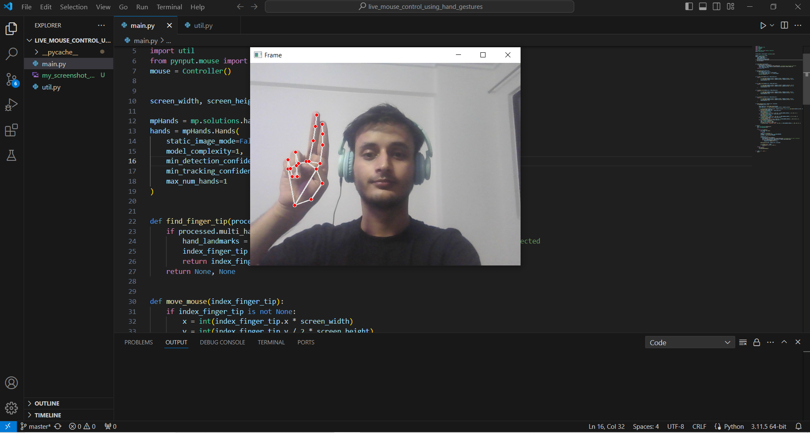
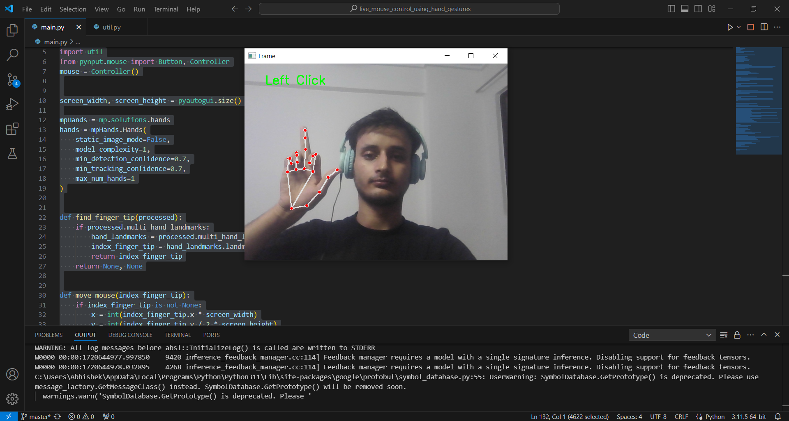
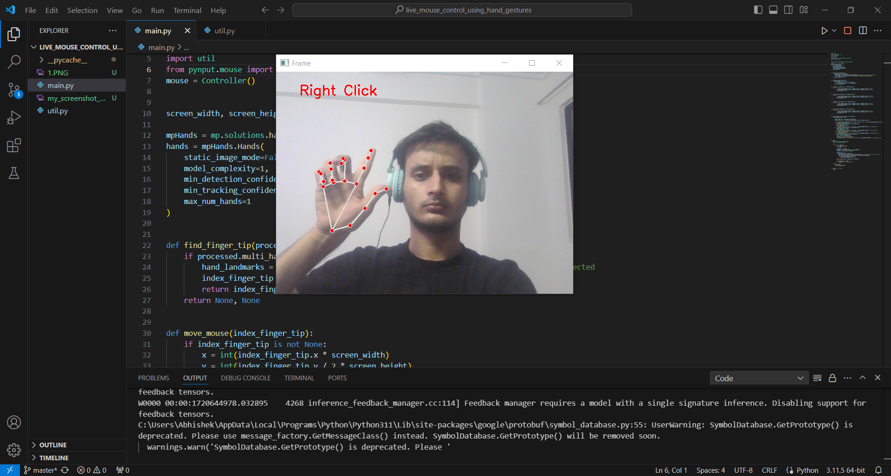
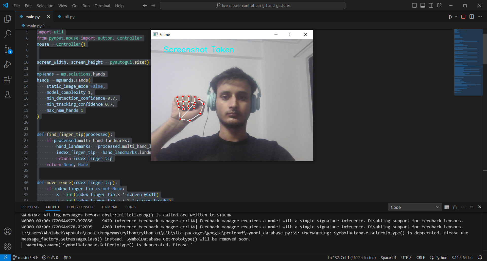

# Virtual Mouse Using Hand Gesture Recognition

##Youtube Link: https://youtu.be/2AdYonoJp-M?si=XwPr-r31NNdqLjFO 

## Screenshots 

1.) To move mouse pointer using gesture:
   

2.) For left click gesture:
   '

3.) For right click gesture:
   

4.) For Screenshot gesture:
   

## Introduction
The Virtual Mouse Using Hand Gesture Recognition project leverages computer vision and machine learning to simulate mouse functionality through hand gestures. This project aims to create an intuitive and contactless way to control a computer, making it especially useful in scenarios where touch is inconvenient or unsanitary.

## Features
- **Real-Time Hand Detection:** Utilizes the Mediapipe library for efficient and accurate hand detection and tracking in real-time.
- **Gesture Recognition:** Recognizes specific hand gestures to perform mouse functions such as moving the cursor, clicking, scrolling, and more.
- **Customizable Gestures:** Users can customize gestures to map to different mouse actions.
- **High Accuracy:** Incorporates machine learning models to ensure high accuracy in gesture recognition and cursor control.
- **Platform Independence:** Compatible with various operating systems including Windows, macOS, and Linux.

## Tech Stack
- **Python:** Core programming language used for developing the application.
- **OpenCV:** Utilized for image processing and computer vision tasks.
- **Mediapipe:** Google’s open-source library used for real-time hand detection and tracking.
- **Numpy:** Used for numerical operations and array manipulations.
- **PyAutoGUI:** A Python library to control the mouse and keyboard actions programmatically.

## Installation
1. Clone the repository:
    ```bash
    git clone https://github.com/abhiran992/Virtual-Mouse-Using-Hand-Gesture-Recognition-
    ```
2. Navigate to the project directory:
    ```bash
    cd Virtual-Mouse-Using-Hand-Gesture-Recognition-
    ```
3. Create a virtual environment and activate it:
    ```bash
    python -m venv venv
    source venv/bin/activate  # On Windows: venv\Scripts\activate
    ```
4. Install the required dependencies:
    ```bash
    pip install -r requirements.txt
    ```

## Usage
1. Run the main script to start the virtual mouse application:
    ```bash
    python main.py
    ```
2. Ensure your webcam is connected and pointed towards your hand.
3. Use predefined hand gestures to control the mouse. For example:
    - **Move Cursor:** Move your index finger to guide the cursor.
    - **Left Click:** Pinch your thumb and index finger together.
    - **Right Click:** Pinch your thumb and middle finger together.
    - **Scroll:** Use a specific gesture (e.g., sliding your hand up and down) to scroll.

## Customizing Gestures
You can customize the gestures by modifying the `gesture_config.py` file. This file contains the mapping of gestures to mouse actions. Simply update the gestures as per your requirements and restart the application.

## Acknowledgements
- The Mediapipe team for providing an excellent hand detection library.
- The OpenCV community for continuous support and updates.
- The PyAutoGUI developers for simplifying mouse and keyboard automation.

